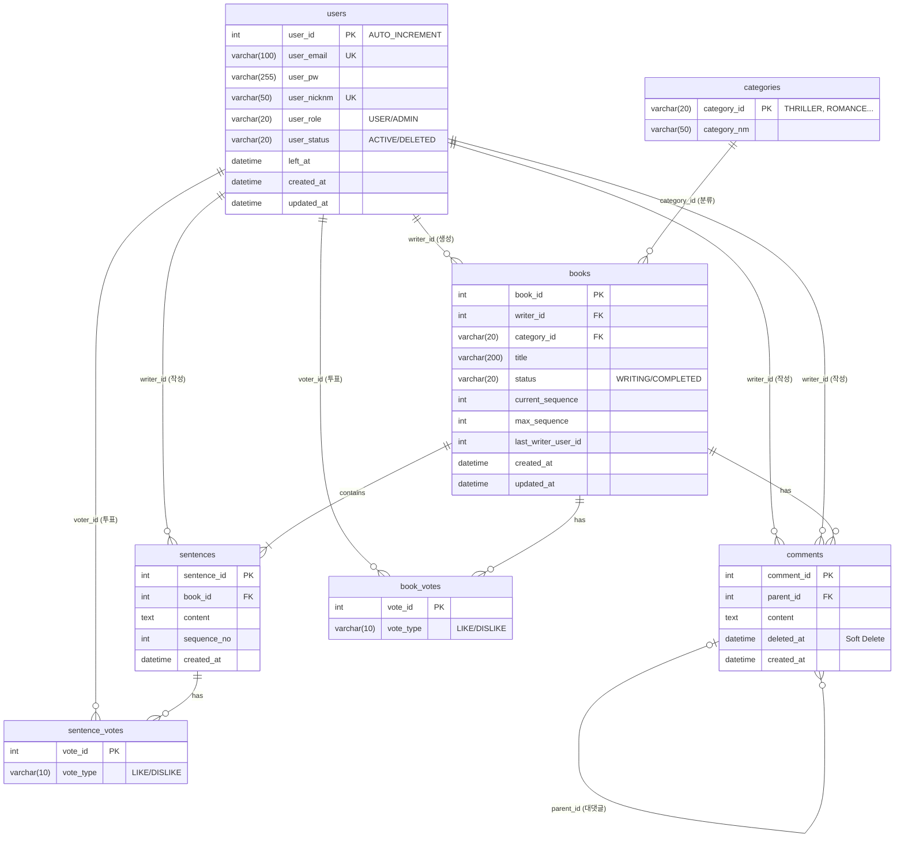

<div align="center"></div>

# 📚 Next Page : 우리가 함께 만드는 실시간 릴레이 소설
> **"당신의 한 문장이 베스트셀러의 시작이 됩니다."**  
> 누구나 작가가 되어 실시간으로 소설을 완성하는 집단 지성 창작 플랫폼

<br>

## 📑 목차

### Part 1. 프로젝트 소개
1. [프로젝트 소개](#1--프로젝트-소개)
2. [팀원 및 역할 분담](#2--팀원-및-역할-분담-team-next-page)
3. [기술 스택](#3-%EF%B8%8F-기술-스택-tech-stack)
4. [주요 기능](#4--주요-기능-key-features)
5. [요구사항 및 유스케이스](#5--요구사항-및-유스케이스-requirements--use-case)
6. [ERD 설계](#6-%EF%B8%8F-erd-설계-entity-relationship)
7. [Database Schema](#7--database-schema-ddl)
8. [API 명세](#8--api-명세-endpoint-example)
9. [패키지 구조](#9--패키지-구조-package-structure)

### Part 2. 개발자 가이드
1. [코딩 컨벤션 및 패턴](#1-%EF%B8%8F-코딩-컨벤션-및-패턴)
2. [협업 컨벤션](#2--협업-컨벤션-collaboration)
3. [라이브러리 및 도구 활용](#3-%EF%B8%8F-라이브러리-및-도구-활용)

<br>

# 🚀 Part 1. 프로젝트 소개

## 1. 📝 프로젝트 소개
**Next Page**는 한 사람이 모든 이야기를 쓰는 것이 아니라, 여러 사용자가 **문장 단위로 이어 쓰며 하나의 소설을 완성**하는 릴레이 창작 서비스입니다.

단순한 게시판이 아닙니다. **WebSocket을 활용한 실시간 타이핑 표시**, **순서(Sequence) 제어**, **투표 기반 평가**가 결합된 몰입형 창작 플랫폼입니다. 앞사람이 글을 완료해야만 뒷사람이 쓸 수 있는 **동시성 제어**와 **도메인 규칙**을 엄격하게 준수합니다.

### 📅 개발 기간
* **2025.12.23 ~ 2026.01.16**

### 📊 프로젝트 진행 현황 (2026.01.13 최종 업데이트)

| 기능 영역 | 상태 | 완료 항목 |
|:---:|:---:|:---|
| **⚡ 실시간/웹소켓** | ✅ 완료 | **실시간 타이핑 표시(Typing Indicator)**, **새 소설/문장/댓글 실시간 푸시**, STOMP 프로토콜 적용 |
| **🔐 인증/인가** | ✅ 완료 | JWT 기반 로그인/로그아웃, 토큰 갱신, **Refresh Token 자동 로그인**, 강제 로그인 모달 UX |
| **👤 회원 관리** | ✅ 완료 | 회원가입/탈퇴(Soft Delete), 관리자 기능, **실시간 입력값 검증(이메일/닉네임/패스워드)** |
| **📖 소설 집필** | ✅ 완료 | 소설 생성, 이어쓰기(순서 제어), **연속 작성 방지**, 자동 완결 처리 |
| **📚 소설 조회** | ✅ 완료 | 목록 조회(페이징/정렬/필터링/검색), 상세 조회, **책 넘김 효과 뷰어 모드** |
| **❤️ 반응/평가** | ✅ 완료 | **개추/비추(Thumb Up/Down) 투표 시스템**, 계층형 댓글/대댓글, Soft Delete |
| **🧑‍💼 마이페이지** | ✅ 완료 | 활동 통계 대시보드 (집필/반응 수), 내 서재 관리 |
| **🎨 UI/UX** | ✅ 완료 | **Cute Pop 디자인**, **모바일 Pull-to-Refresh**, 토스트 알림, 반응형 레이아웃 |
| **🧪 테스트** | ✅ 완료 | 전체 API 시나리오 테스트 (`http/api-test.http`) |

<br>

## 2. 👥 팀원 및 역할 분담 (Team Next Page)
우리는 **도메인 주도 설계(DDD)** 원칙에 따라, 기능 단위가 아닌 **도메인(Context)** 단위로 역할을 분담하여 전문성을 높였습니다.

| 이름 | 포지션 | 담당 도메인 & 핵심 역할 |
|:---:|:---:|:---|
| **정진호** | **Team Leader** | **🏛 Core & Architecture**<br>- 프로젝트 아키텍처 설계 (CQRS, WebSocket)<br>- 실시간 타이핑 및 알림 시스템 구현<br>- `Story` 애그리거트 상태/순서 제어 로직<br>**✍️ Writing & Query**<br>- 문장 작성(Append) 및 유효성 검사<br>- 동적 쿼리(MyBatis) 기반 조회/검색 최적화 |
| **김태형** | **Sub Leader** | **🔐 Member & Auth**<br>- Spring Security + JWT 인증/인가 시스템<br>- **Soft Delete**를 적용한 안전한 회원 탈퇴/관리<br>- 실시간 유효성 검증 로직 및 마이페이지 |
| **정병진** | **Developer** | **❤️ Reaction & Support**<br>- **개추/비추(Thumb Up/Down)** 투표 시스템<br>- 계층형 댓글(대댓글) 구조 설계 및 구현<br>- 관리자 권한(댓글/유저 관리) 기능 구현 |

<br>

## 3. 🛠️ 기술 스택 (Tech Stack)

### 💻 개발 환경 (Development Environment)
*   **IDE:** IntelliJ IDEA
*   **JDK:** Java 17 (Amazon Corretto or Azul Zulu)
*   **Database:** MariaDB 10.6+
*   **Build Tool:** Gradle
*   **Framework:** Spring Boot 3.5.9

### Backend & Real-time


### Frontend


### Architecture Strategy
*   **RESTful API:** 자원(Resource) 중심의 명확한 URI 설계 및 HTTP Method 활용
*   **CQRS Pattern:**
    *   **Command (쓰기):** JPA (Domain Logic, Dirty Checking) - 데이터 무결성 보장
    *   **Query (읽기):** MyBatis (Dynamic Query) - 복잡한 통계/조회 성능 최적화
*   **Event-Driven:** WebSocket을 통한 실시간 상태 동기화 (작성 중, 댓글 작성 등)

<br>

## 4. ✨ 주요 기능 (Key Features)

### ⚡ 1. 실시간 인터랙션 (Real-time Interaction)
*   **타이핑 인디케이터:** 누가 지금 다음 문장을 쓰고 있는지, 댓글을 달고 있는지 실시간으로 보여줍니다.
*   **라이브 업데이트:** 새로 고침 없이도 새로운 소설, 이어진 문장, 달린 댓글이 화면에 즉시 나타납니다.
*   **Pull-to-Refresh:** 모바일 환경에서 화면을 당겨서 손쉽게 새로고침할 수 있습니다.

### 🚀 2. 릴레이 소설 창작 (Core)
*   **이야기 시작:** 제목, 장르(로맨스/스릴러 등), 첫 문장을 등록하여 방을 개설합니다.
*   **순서 제어 (Sequence Control):**
    *   현재 순서(`current_sequence`)인 경우에만 작성 권한이 부여됩니다.
    *   **연속 작성 금지:** 독점을 막기 위해 바로 앞 문장을 쓴 사람은 연달아 쓸 수 없습니다.
*   **자동 완결:** 설정된 최대 문장 수에 도달하면 이야기는 `COMPLETED` 상태로 잠깁니다.

### ❤️ 3. 평가 및 소통 (Reaction)
*   **개추/비추 (Thumb Up/Down):** 단순 좋아요가 아닌, 문장과 소설에 대해 명확한 호불호를 표현할 수 있습니다.
*   **계층형 댓글:** 소설에 대해 깊이 있는 토론을 할 수 있도록 대댓글 기능을 제공합니다.

### 🔐 4. 회원 서비스 (Secure & Soft Delete)
*   **안전한 탈퇴:** 회원이 탈퇴해도 작성한 문장은 사라지지 않습니다 (데이터 보존).
*   **강제 로그인 유도:** 비회원도 구경은 가능하지만, 참여하려고 하면 자연스럽게 로그인 모달이 뜹니다.
*   **자동 로그인:** Refresh Token을 활용해 매번 로그인할 필요 없이 앱처럼 바로 이용 가능합니다.

### 🎨 5. 사용자 경험 (Cute Pop UI)
*   **감성 디자인:** 파스텔톤 컬러(#FF8BA7, #845EF7)와 둥근 모서리, 통통 튀는 애니메이션.
*   **책 뷰어 모드:** 완결된 소설은 실제 전자책처럼 편하게 읽을 수 있는 전용 뷰어를 제공합니다.
*   **스마트 검증:** 가입 시 닉네임/이메일 중복을 키보드를 떼자마자 알려줍니다.

<br>

<br>

## 5. 📋 요구사항 및 유스케이스 (Requirements & Use Case)

### ✅ 기능 요구사항 (Functional Requirements)

### 5.1 요구사항 분류 기준
*   **FR-1xx (회원/인증):** 가입, 로그인(JWT), 탈퇴, 마이페이지
*   **FR-2xx (소설 관리):** 생성, 조회, 검색(MyBatis), 뷰어
*   **FR-3xx (집필/릴레이):** 이어쓰기, 순서 제어, 실시간 알림
*   **FR-4xx (반응/소통):** 개추/비추 투표, 댓글/대댓글
*   **FR-5xx (시스템):** WebSocket, 보안, 에러 처리

<br>

### 5.2 상세 기능 요구사항

| ID | 대분류 | 요구사항 명 | 상세 내용 |
|:---:|:---:|:---:|:---|
| **FR-101** | 회원 | 가입/검증 | 이메일/닉네임 실시간 중복 검증, 비밀번호 복잡도 체크. |
| **FR-104** | 회원 | 자동 로그인 | Refresh Token을 쿠키/스토리지에 저장해 세션 유지 (Silent Refresh). |
| **FR-109** | 회원 | Soft Delete | 탈퇴 시 실제 삭제하지 않고 상태만 변경, 작성 글 유지. |
| **FR-201** | 소설 | 소설 생성 | 제목, 카테고리, 최대 문장 수 설정. |
| **FR-208** | 소설 | 뷰어 모드 | 완결된 소설은 깔끔한 텍스트 뷰어로 제공. |
| **FR-301** | 집필 | 순서 제어 | 현재 시퀀스 및 이전 작성자 체크(연속 작성 불가). |
| **FR-303** | 집필 | 문장 등록 | 문장 등록 시 WebSocket으로 구독자들에게 실시간 전송. |
| **FR-310** | 집필 | 작성 중 알림 | "000님이 작성 중..." 메시지를 실시간으로 브로드캐스팅. |
| **FR-401** | 반응 | 개추/비추 | 소설 및 문장에 대해 Up/Down 투표 기능 (1인 1투표). |
| **FR-501** | 시스템 | WebSocket | STOMP 활용 `/topic/books`, `/topic/typing` 등 구독/발행. |

<br>

### ✅ 비기능 요구사항 (Non-Functional Requirements)

| ID | 분류 | 요구사항 명 | 상세 내용 |
|:---:|:---:|:---:|:---|
| **NFR-101** | 보안 | 토큰 검증 | 모든 API 요청 시 JWT 유효성 검증 (만료 시 401). |
| **NFR-201** | UX | 반응성 | 모든 액션에 토스트 알림 제공, 모달 UX 활용. |
| **NFR-202** | UX | 실시간성 | 타이핑 인디케이터는 3초 유휴 시 자동 사라짐 처리. |
| **NFR-301** | 성능 | 조회 최적화 | 복잡한 통계/목록 조회는 MyBatis로 최적화. |
| **NFR-302** | 아키텍처 | CQRS | 명령(JPA)과 조회(MyBatis)의 명확한 분리. |


<br>

## 6. 🗂️ ERD 설계 (Entity Relationship)
`users`의 Soft Delete 상태값과 역할별로 명확히 구분된 FK(`writer_id`, `voter_id`) 구조입니다.



<br>

## 7. 💾 Database Schema (DDL)

<details>
<summary>👉 <b>Click to view SQL Script</b></summary>

```sql
-- 1. 사용자 (Users)
CREATE TABLE `users` (
    `user_id`      INT          NOT NULL AUTO_INCREMENT,
    `user_email`   VARCHAR(100) NOT NULL COMMENT '로그인 ID',
    `user_pw`      VARCHAR(255) NOT NULL,
    `user_nicknm`  VARCHAR(50)  NOT NULL,
    `user_role`    VARCHAR(20)  NOT NULL DEFAULT 'USER',
    `user_status`  VARCHAR(20)  NOT NULL DEFAULT 'ACTIVE' COMMENT 'ACTIVE, DELETED',
    `left_at`      DATETIME     NULL COMMENT '탈퇴일시',
    `created_at`   DATETIME     NOT NULL DEFAULT NOW(),
    `updated_at`   DATETIME     NULL,
    PRIMARY KEY (`user_id`),
    UNIQUE KEY `uk_users_email` (`user_email`),
    UNIQUE KEY `uk_users_nicknm` (`user_nicknm`)
);

-- 2. 카테고리 (Categories)
CREATE TABLE `categories` (
    `category_id` VARCHAR(20) NOT NULL COMMENT 'PK: THRILLER, ROMANCE',
    `category_nm` VARCHAR(50) NOT NULL,
    PRIMARY KEY (`category_id`)
);

-- 3. 소설 (Books)
CREATE TABLE `books` (
    `book_id`             INT          NOT NULL AUTO_INCREMENT,
    `writer_id`           INT          NOT NULL,
    `category_id`         VARCHAR(20)  NOT NULL,
    `title`               VARCHAR(200) NOT NULL,
    `status`              VARCHAR(20)  NOT NULL DEFAULT 'WRITING',
    `current_sequence`    INT          NOT NULL DEFAULT 1,
    `max_sequence`        INT          NOT NULL DEFAULT 20,
    `last_writer_user_id` INT          NULL COMMENT '연속 작성 방지',
    `created_at`          DATETIME     NOT NULL DEFAULT NOW(),
    `updated_at`          DATETIME     NULL,
    PRIMARY KEY (`book_id`)
);

-- 4. 문장 (Sentences)
CREATE TABLE `sentences` (
    `sentence_id` INT      NOT NULL AUTO_INCREMENT,
    `book_id`     INT      NOT NULL,
    `writer_id`   INT      NOT NULL,
    `content`     TEXT     NOT NULL,
    `sequence_no` INT      NOT NULL,
    `created_at`  DATETIME NOT NULL DEFAULT NOW(),
    PRIMARY KEY (`sentence_id`)
);

-- 5. 댓글 (Comments)
CREATE TABLE `comments` (
    `comment_id` INT      NOT NULL AUTO_INCREMENT,
    `parent_id`  INT      NULL COMMENT '대댓글 부모 ID',
    `book_id`    INT      NOT NULL,
    `writer_id`  INT      NOT NULL,
    `content`    TEXT     NOT NULL,
    `deleted_at` DATETIME NULL COMMENT 'Soft Delete',
    `created_at` DATETIME NOT NULL DEFAULT NOW(),
    `updated_at` DATETIME NULL,
    PRIMARY KEY (`comment_id`)
);

-- 6. 소설 투표 (Book Votes)
CREATE TABLE `book_votes` (
    `vote_id`    INT         NOT NULL AUTO_INCREMENT,
    `book_id`    INT         NOT NULL,
    `voter_id`   INT         NOT NULL,
    `vote_type`  VARCHAR(10) NOT NULL COMMENT 'LIKE, DISLIKE',
    `created_at` DATETIME    NOT NULL DEFAULT NOW(),
    PRIMARY KEY (`vote_id`),
    UNIQUE KEY `uk_book_voter` (`book_id`, `voter_id`),
    CONSTRAINT `chk_book_vote_type` CHECK (`vote_type` IN ('LIKE', 'DISLIKE'))
);

-- 7. 문장 투표 (Sentence Votes)
CREATE TABLE `sentence_votes` (
    `vote_id`     INT         NOT NULL AUTO_INCREMENT,
    `sentence_id` INT         NOT NULL,
    `voter_id`    INT         NOT NULL,
    `vote_type`   VARCHAR(10) NOT NULL COMMENT 'LIKE, DISLIKE',
    `created_at`  DATETIME    NOT NULL DEFAULT NOW(),
    PRIMARY KEY (`vote_id`),
    UNIQUE KEY `uk_sentence_voter` (`sentence_id`, `voter_id`),
    CONSTRAINT `chk_sentence_vote_type` CHECK (`vote_type` IN ('LIKE', 'DISLIKE'))
);
```
</details>

<br>

## 8. 🔌 API 명세 (Endpoint Example)

### 🔐 인증 (Auth) API

| Method | URI | 설명 |
|:---:|:---|:---|
| POST | `/api/auth/signup` | 회원가입 (실시간 중복 검증 포함) |
| POST | `/api/auth/login` | 로그인 (JWT 발급, 자동로그인 지원) |
| POST | `/api/auth/refresh` | Silent Refresh Token 갱신 |
| DELETE | `/api/auth/admin/users/{id}` | 관리자 권한 회원 강제 탈퇴 |

### 📖 소설 & 실시간 API (Books)

| Method | URI | 설명 |
|:---:|:---|:---|
| GET | `/api/books` | 소설 검색/조회 (Query Service) |
| GET | `/api/books/{id}` | 상세 정보 (실시간 투표수 포함) |
| POST | `/api/books/{id}/sentences` | 문장 이어쓰기 (WebSocket 알림 발송) |
| WS | `/ws` | WebSocket 연결 엔드포인트 |
| SUB | `/topic/typing` | 실시간 타이핑 상태 구독 |

<br>

## 9. 📦 패키지 구조 (Package Structure)
**CQRS 패턴**을 적용하여 Command(변화)와 Query(조회) 책임을 분리했습니다.

```text
src/main/java/com/team2/nextpage
│
├── 📂 auth                       // 🔐 인증 (JWT, UserDetails)
├── 📂 config                     // ⚙️ 설정 (Security, WebSocket, Swagger)
├── 📂 common                     // 🧰 공통 (Exception, Utils, Response)
│
├── 📂 command                    // ✏️ [Command: Write/Update/Delete] - JPA
│   ├── 📂 member                 // 회원 가입/탈퇴/수정
│   ├── 📂 book                   // 소설 생성/문장 작성 (Domain Logic)
│   └── 📂 reaction               // 투표/댓글 작성 (Interaction)
│
└── 📂 query                      // 📖 [Query: Read/Search] - MyBatis
    ├── 📂 member                 // 마이페이지 조회
    ├── 📂 book                   // 소설 목록/통계/상세 조회 (Optimized)
    └── 📂 reaction               // 댓글 목록 조회 (Tree Structure)
```

<br>

# 🛠️ Part 2. 개발자 가이드

## 1. 🏛️ 코딩 컨벤션 및 패턴

### 1.1 CQRS & Architecture
*   **Command:** 데이터 상태를 변경하는 모든 로직은 `command` 패키지에서 **JPA**를 사용해 처리합니다.
    *   Entity의 비즈니스 메서드를 통해 상태를 변경합니다 (Setter 지양).
*   **Query:** 데이터 조회가 주 목적(화면 표시 등)인 로직은 `query` 패키지에서 **MyBatis**를 사용합니다.
    *   복잡한 조인, 통계, DTO 매핑 최적화에 유리합니다.

### 1.2 WebSocket Convention
*   **Prefix:** 클라이언트 요청은 `/app`, 서버 브로드캐스팅은 `/topic`을 사용합니다.
*   **Payload:** 모든 실시간 메시지는 JSON 포맷으로 주고받습니다.

### 1.3 Security & Utils
*   `SecurityUtil.getCurrentUserId()`를 통해 언제든 안전하게 현재 사용자 ID를 획득할 수 있습니다.
*   하드코딩된 ID 대신 반드시 동적 ID를 사용하세요.

---
Copyright © 2026 **Team Next Page**. All rights reserved.
